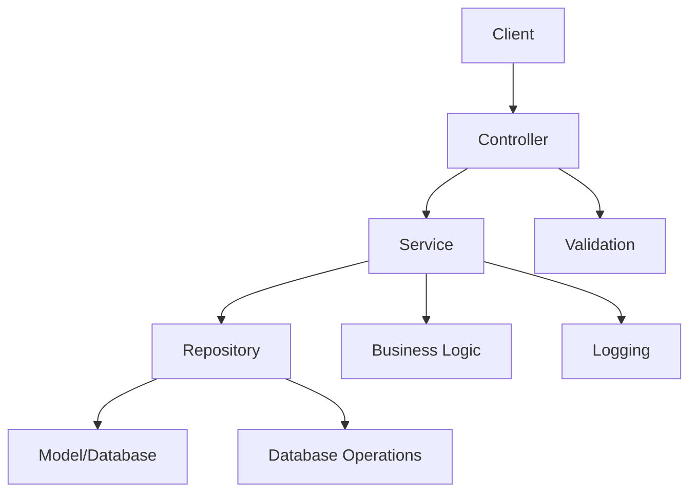

# 🏗️ Architecture avec Services et Repositories

## 📋 Vue d'ensemble

Cette nouvelle architecture implémente le **Service Layer Pattern** et le **Repository Pattern** pour améliorer la séparation des responsabilités, la testabilité et la maintenabilité du code.

## 🗂️ Structure des dossiers

```
app/
├── Contracts/                  # Interfaces (contrats)
│   ├── AuthServiceInterface.php
│   └── UserRepositoryInterface.php
├── Services/                   # Couche de logique métier
│   └── AuthService.php
├── Repositories/              # Couche d'accès aux données
│   └── UserRepository.php
├── Providers/                 # Service Providers
│   └── RepositoryServiceProvider.php
└── Http/Controllers/API/      # Contrôleurs (couche présentation)
    └── AuthController.php
```

## 🔄 Flux de données



## 📊 Comparaison : Avant vs Après

### **❌ Avant (Architecture simple)**
```php
// AuthController.php
public function login(Request $request): JsonResponse
{
    // Validation directe
    $request->validate([...]);
    
    // Logique métier dans le contrôleur
    if (!Auth::attempt($request->only('email', 'password'))) {
        return response()->json([...], 401);
    }
    
    // Accès direct au modèle
    $user = Auth::user();
    $token = $user->createToken('auth_token')->plainTextToken;
    
    return response()->json([...]);
}
```

### **✅ Après (Architecture avec services)**
```php
// AuthController.php
public function login(Request $request): JsonResponse
{
    try {
        $request->validate([...]);
        
        // Délégation à la couche service
        $result = $this->authService->login([
            'email' => $request->email,
            'password' => $request->password,
        ]);
        
        return response()->json([...]);
    } catch (\Exception $e) {
        return response()->json([...], 401);
    }
}
```

## 🎯 Avantages de la nouvelle architecture

### **1. Séparation des responsabilités**
- **Controller** : Gestion des requêtes HTTP uniquement
- **Service** : Logique métier et orchestration
- **Repository** : Accès aux données et requêtes

### **2. Testabilité améliorée**
```php
// Test unitaire du service (sans base de données)
public function test_login_with_valid_credentials()
{
    $mockRepository = Mockery::mock(UserRepositoryInterface::class);
    $authService = new AuthService($mockRepository);
    
    $mockRepository->shouldReceive('findByEmail')
                   ->once()
                   ->andReturn($user);
    
    $result = $authService->login(['email' => 'test@test.com', 'password' => 'password']);
    
    $this->assertArrayHasKey('token', $result);
}
```

### **3. Réutilisabilité**
```php
// Utilisation du service dans d'autres contextes
class SocialAuthController extends Controller
{
    public function googleCallback()
    {
        $userData = $this->getSocialUserData();
        
        // Réutilisation du service d'authentification
        $result = $this->authService->register($userData);
        
        return redirect()->with('token', $result['token']);
    }
}
```

### **4. Injection de dépendances**
```php
// RepositoryServiceProvider.php
public function register(): void
{
    $this->app->bind(UserRepositoryInterface::class, UserRepository::class);
    $this->app->bind(AuthServiceInterface::class, AuthService::class);
}
```

## 📝 Détail des couches

### **1. Contracts (Interfaces)**
- Définissent les contrats que doivent respecter les services et repositories
- Permettent l'inversion de dépendances
- Facilitent les tests avec des mocks

### **2. Services**
- Contiennent la logique métier
- Orchestrent les appels aux repositories
- Gèrent les logs et la validation métier
- Indépendants de la couche présentation

### **3. Repositories**
- Encapsulent l'accès aux données
- Fournissent une interface simple pour les requêtes
- Abstraient la complexité des requêtes SQL
- Facilitent le changement de source de données

### **4. Controllers**
- Se concentrent sur la gestion HTTP
- Délèguent la logique métier aux services
- Gèrent la validation des entrées
- Formatent les réponses

## 🔍 Exemple concret : Connexion utilisateur

### **1. Requête HTTP**
```bash
POST /api/auth/login
{
    "email": "john@example.com",
    "password": "password123"
}
```

### **2. Controller (AuthController)**
```php
public function login(Request $request): JsonResponse
{
    // 1. Validation des données d'entrée
    $request->validate([
        'email' => 'required|email',
        'password' => 'required',
    ]);

    // 2. Délégation au service
    $result = $this->authService->login([
        'email' => $request->email,
        'password' => $request->password,
    ]);

    // 3. Formatage de la réponse
    return response()->json([
        'success' => true,
        'message' => 'Connexion réussie',
        'data' => $result
    ]);
}
```

### **3. Service (AuthService)**
```php
public function login(array $credentials): array
{
    // 1. Logging de la tentative
    Log::info("Tentative de connexion pour: {$credentials['email']}");

    // 2. Validation des identifiants
    if (!$this->validateCredentials($credentials)) {
        $this->logLoginAttempt($credentials['email'], false);
        throw new \Exception('Identifiants incorrects');
    }

    // 3. Génération du token
    $user = Auth::user();
    $token = $this->generateToken($user);

    // 4. Logging du succès
    $this->logLoginAttempt($credentials['email'], true);

    return [
        'user' => $user,
        'token' => $token
    ];
}
```

### **4. Repository (UserRepository)**
```php
public function findByEmail(string $email): ?User
{
    Log::info("Recherche utilisateur par email: {$email}");
    
    return $this->model
        ->where('email', $email)
        ->first();
}
```

## 🚀 Connexions à la base de données

### **Moments d'exécution des requêtes SQL :**

1. **`Auth::attempt()`** dans `AuthService::validateCredentials()`
   ```sql
   SELECT * FROM `users` WHERE `email` = ? LIMIT 1
   ```

2. **`$user->createToken()`** dans `AuthService::generateToken()`
   ```sql
   INSERT INTO `personal_access_tokens` (...) VALUES (...)
   ```

3. **Repository calls** (si utilisés)
   ```sql
   -- UserRepository::findByEmail()
   SELECT * FROM `users` WHERE `email` = ? LIMIT 1
   
   -- UserRepository::create()
   INSERT INTO `users` (name, email, password, created_at, updated_at) VALUES (...)
   ```

## 🔧 Configuration requise

### **1. Enregistrement du ServiceProvider**
```php
// bootstrap/providers.php
return [
    App\Providers\AppServiceProvider::class,
    App\Providers\RepositoryServiceProvider::class, // ✅ Ajouté
];
```

### **2. Autoloading des nouvelles classes**
```bash
composer dump-autoload
```

## 📈 Évolutions futures possibles

### **1. Cache Layer**
```php
class CachedUserRepository implements UserRepositoryInterface
{
    public function findByEmail(string $email): ?User
    {
        return Cache::remember("user.{$email}", 3600, function() use ($email) {
            return $this->repository->findByEmail($email);
        });
    }
}
```

### **2. Event System**
```php
class AuthService implements AuthServiceInterface
{
    public function login(array $credentials): array
    {
        // ... logique existante ...
        
        // Déclencher un événement
        event(new UserLoggedIn($user));
        
        return $result;
    }
}
```

### **3. Audit Trail**
```php
class AuthService implements AuthServiceInterface
{
    public function logLoginAttempt(string $email, bool $success, ?string $ipAddress = null): void
    {
        // Enregistrement dans une table d'audit
        AuditLog::create([
            'action' => 'login_attempt',
            'email' => $email,
            'success' => $success,
            'ip_address' => $ipAddress,
            'user_agent' => request()->userAgent(),
            'created_at' => now()
        ]);
    }
}
```

Cette architecture offre une base solide et extensible pour votre application Laravel ! 🎉
